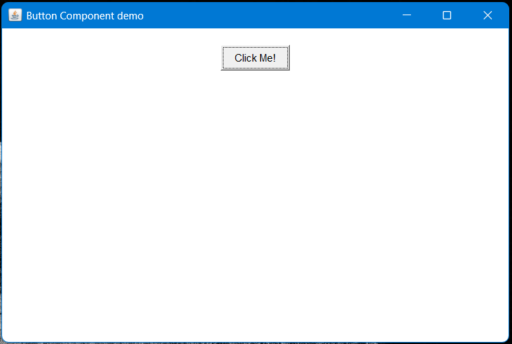
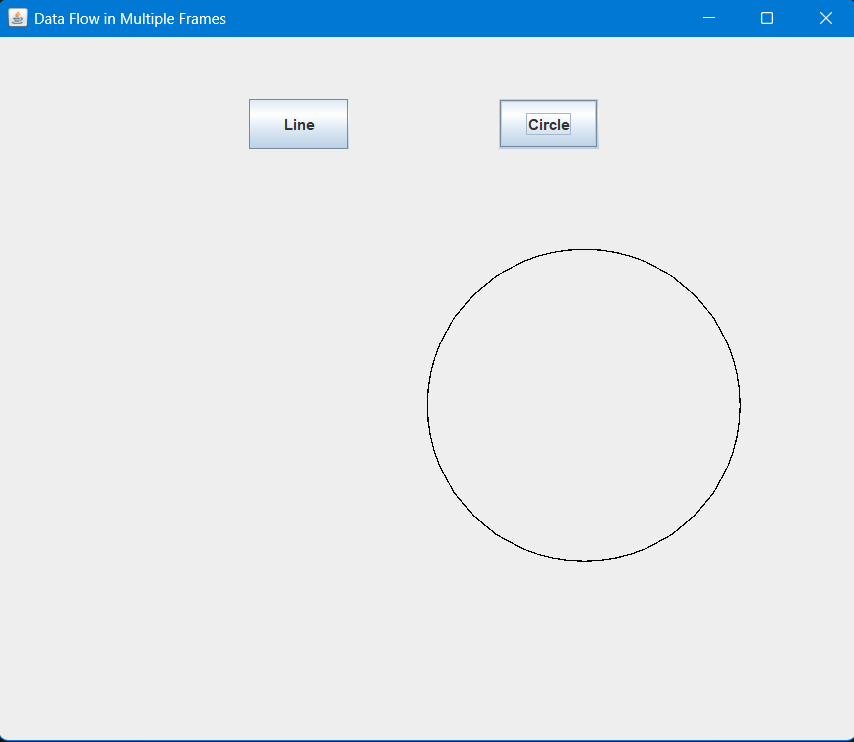
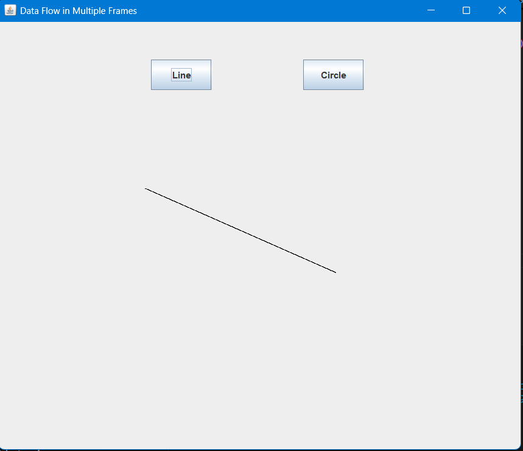
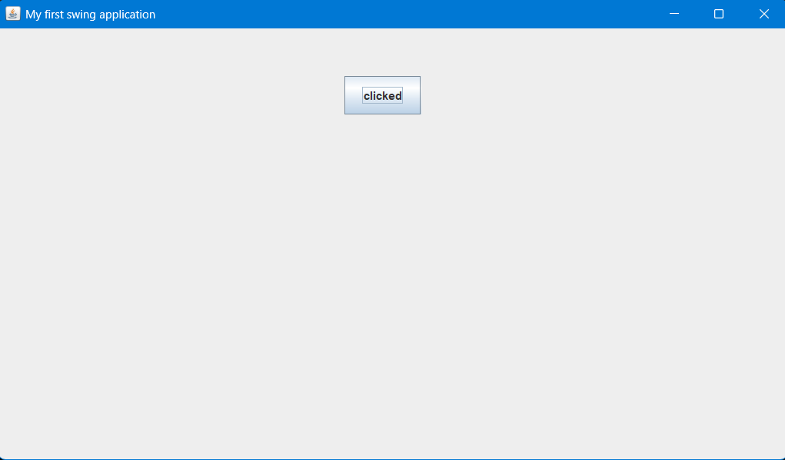
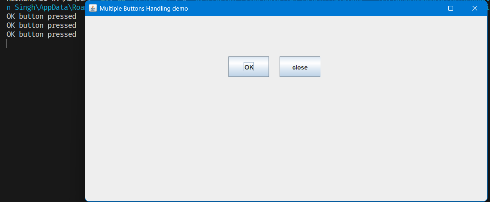
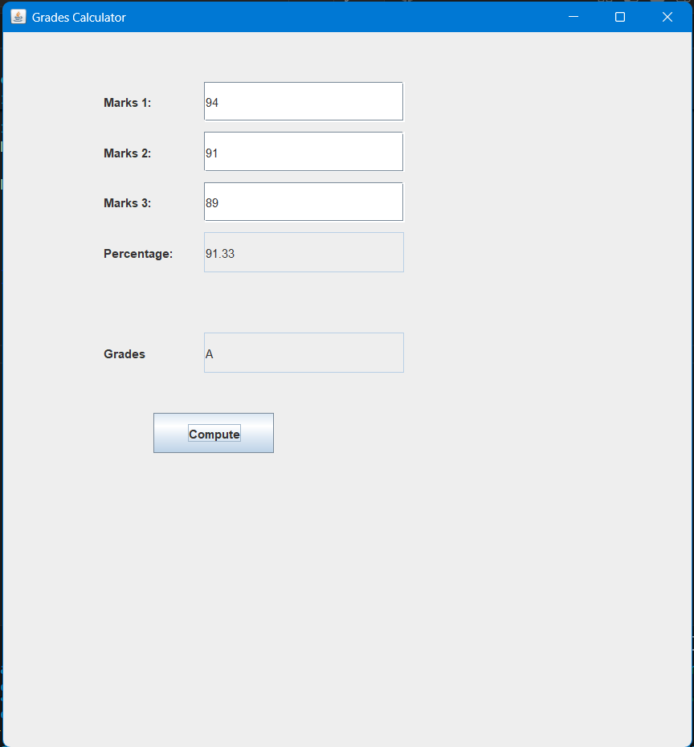
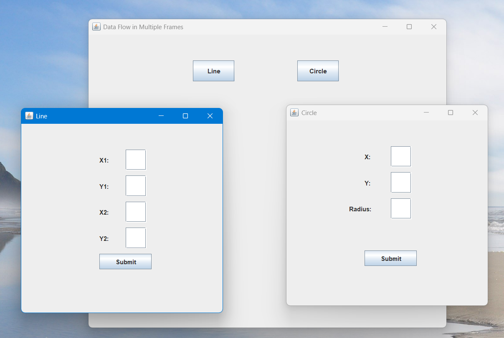

# Java GUI Programs

This folder contains basic Java GUI examples using AWT and Swing.

## Programs

- `AwtExample1.java`
- `AwtExample2.java`
- `Circle.java`
- `Line.java`
- `MyFrame.java`
- `SwingEx1.java`
- `SwingEx2.java`
- `SwingEx3.java`

## Output Screenshots

### AWT Example 2

### Circle

### Line

### Swing Example 1

### Swing Example 2

### Swing Example 3

### Swing Example 4

